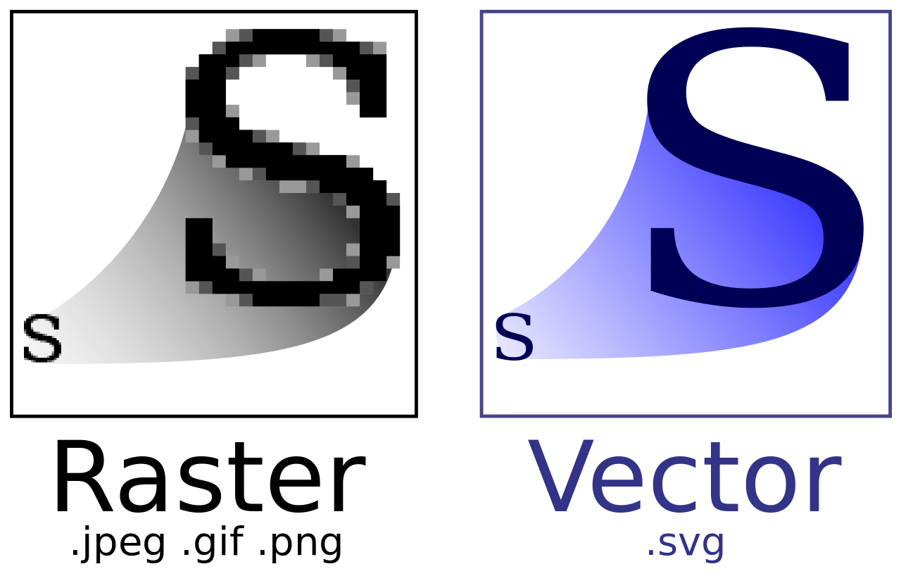

# Vectrabool Project

## Project orientation
This project aims to figuring out the algorithms that are used to transform a bitmap image into vector image and trying to optimize the methods.
**What makes our project different from the other existing softwares ?**

## Bitmap (Raster) Images

Bitmap images are static. They are comprised of hundreds, and more often thousands, of tiny coloured dots called pixels. Each pixel has a fixed position within the makeup of the bitmap, and when these pixels are displayed together on a computer screen, they form an image. Bitmap images are, with a few exceptions, the standard for internet graphics, as well as Windows icons and backgrounds. Bitmaps are also the standard format for images captured by scanners and digital cameras. But, for some kind of purposes, people want to have a kind of images which dynamic, in the sense that we can enlarge the image without destruct it.

## Vector images

A [Vector image](https://en.wikipedia.org/wiki/Vector_graphics) is made up of various “objects” such as lines and shapes. These objects are defined mathematically by a set of algorithms or formulas, which allow them to be redrawn over and over. Whereas the bitmap is static, the vector image is dynamic. It is not restricted by size or shape. It can easily be shrunk or enlarged, widened or compressed.

The comparison of bitmap and vector graphic images can be observed in this figure :

## General Framework

The software takes a bitmap image as an input, and will result a vector graphic image (in SVG format). In general, the algorithms used in the image convertion coverts “contour detection”, “color transition”, “polygonalization”, and “corner detection”. For further details, kindly check the page "About" and "How To"
